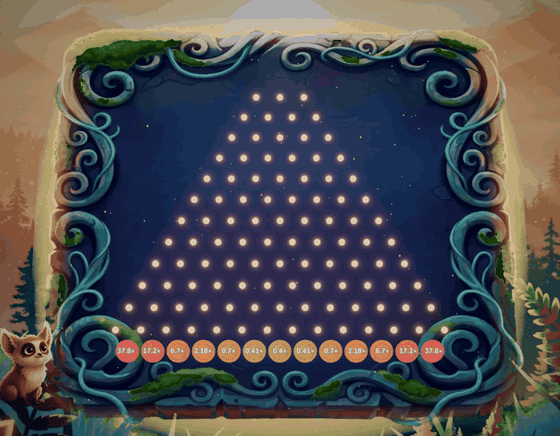
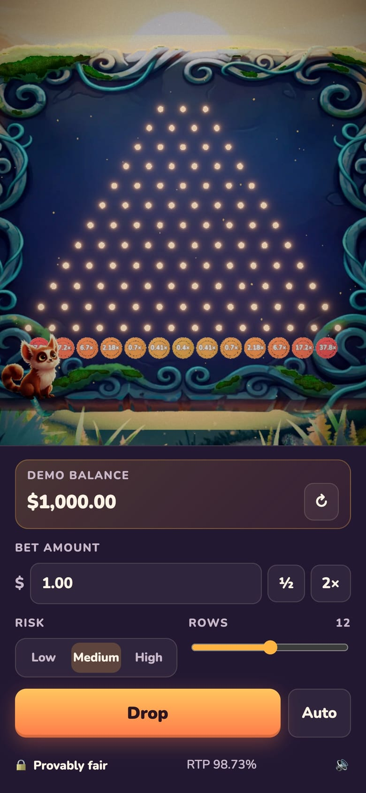

<div align="center">


**A provably fair Plinko game for the browser, built with Three.js and painted in the style of Blender Studio's _Spring_.**

[](https://jungle-plinko.vercel.app)




</div>

> [!NOTE]
> This is a prototype that uses **demo credits only**. No real money is involved.

## Highlights

- **Provably fair and server-authoritative.** Every result comes from `HMAC-SHA256(serverSeed, clientSeed:nonce:round)`, decided on the server. Players can rotate seeds and re-verify any bet in the browser with the same code.
- **Pay tables solved for a 99% target RTP.** There are 3 risk levels × 8–16 rows, with payouts from 0.2× up to 1000×. A Monte Carlo script checks them.
- **No database needed.** Sessions travel in an encrypted cookie, so the API runs as Vercel Functions.
- **Painted in the style of _Spring_.** The backdrop is AI-painted, with misty parallax, light shafts, pollen and falling leaves. Every 3D prop has warm rim light, and the image goes through bloom and AgX tone mapping.
- **A painted board.** It has organic edges, volumetric moss that grows over the painted moss, and a light wave that runs along the vines.
- **A mascot animated with AI video.** Clips with a transparent background dissolve into each other as the jungle creature reacts to every drop, near miss, win and loss.
- **Curated sound.** A music loop plays over jungle ambience. The pegs play a kalimba scale as the ball falls, and wins get chimes by payout tier. Losses get a soft, neutral wood "tok", never a celebration.
- **Works on desktop and phones.** It has keyboard shortcuts and ARIA labels, and respects `prefers-reduced-motion`.

## Screenshots

<table>
  <tr>
    <td width="74%"></td>
    <td width="26%"></td>
  </tr>
  <tr>
    <td align="center">Desktop</td>
    <td align="center">Phone</td>
  </tr>
</table>

## Quick start

```bash
git clone git@github.com:ItsJuniorDias/jungle-plinko.git
cd jungle-plinko
npm install
npm run dev
```

Open **http://localhost:5173**. `npm run dev` starts the game API (`:8787`) and the Vite dev server (`:5173`), and Vite proxies `/api` to the API. Nothing else is needed: every AI asset is already in the repo, and the local API generates a temporary session key on its own.

| Key | Action |
| --- | --- |
| <kbd>Space</kbd> | Drop a ball |
| <kbd>M</kbd> | Mute / unmute |
| <kbd>Esc</kbd> | Close the big-win banner |

### Configuration

Copy `.env.example` to `.env`. Every variable is optional for local play.

| Variable | Used by | Purpose |
| --- | --- | --- |
| `SESSION_SECRET` | API | Key for the encrypted session cookie. **Required in production.** Generate one with `openssl rand -base64 32`. |
| `OPENROUTER_API_KEY` | `npm run art`, `npm run mascot` | AI image and video generation |
| `IMAGE_MODEL` | `npm run art`, `npm run mascot` | Image model (default `google/gemini-2.5-flash-image`) |
| `MASCOT_VIDEO_MODEL` | `npm run mascot` | Video model (default `heygen/heygen-video-1`) |
| `API_PORT` | `npm run dev` | Port of the local API (default `8787`) |

### Deploy to Vercel

1. Import the repo in Vercel; the Vite preset is detected. The API in `api/` deploys as Vercel Functions alongside the static build.
2. Add `SESSION_SECRET` under Project → Settings → Environment Variables. Without it, the API answers `server_misconfigured`. Changing it later signs every player out, and each gets a fresh demo wallet.
3. Push to `main`. Every push deploys.

### Scripts

| Command | What it does |
| --- | --- |
| `npm run dev` | API + Vite with hot reload |
| `npm run build` | Type-check and production build to `dist/` |
| `npm run typecheck` | TypeScript only |
| `npm run simulate -- 200000` | Monte Carlo RTP check for 8, 12 and 16 rows at every risk level (default 50,000 bets each) |
| `npm run art` | Generate any missing 2D art ([2D art](#2d-art)) |
| `npm run mascot` | Generate the mascot's video clips ([Mascot clips](#mascot-clips)) |
| `npm run audio` | Rebuild `public/audio/` from the curated sources ([Audio](#audio-1)) |

## How it works

### Provably fair

1. The server creates a random `serverSeed` and shows the player only `sha256(serverSeed)`.
2. Each bet derives floats from `HMAC_SHA256(key = serverSeed, msg = "clientSeed:nonce:round")`. Every 4 bytes become one float in `[0, 1)`.
3. Plinko reads one float per row: below `0.5` the ball goes left, otherwise right. The landing bucket is the number of rights.
4. **Rotate seeds** reveals the old `serverSeed`. Players can check it against the hash shown earlier and recompute any bet. Clicking a result in the history opens the verifier pre-filled with that bet.

The same `shared/` code runs on the server and in the browser (Web Crypto), so verification uses exactly the algorithm that produced the result.

### Pay tables

Bucket `k` on an `n`-row board has probability `C(n,k) / 2ⁿ`. Each risk level fixes a **centre** and an **edge** payout for 8 and 16 rows, interpolated geometrically in between. The curve's exponent is bisected until `Σ p(k)·m(k) = 0.99`, and every multiplier is rounded **down**, so the RTP never exceeds the target.

| Rows | Risk | Min | Max | RTP |
| --- | --- | --- | --- | --- |
| 8 | low / medium / high | 0.5× / 0.4× / 0.2× | 5.6× / 13× / 29× | 98.80% / 98.53% / 98.50% |
| 12 | low / medium / high | 0.5× / 0.4× / 0.2× | 9.46× / 37.8× / 170× | 98.82% / 98.73% / 98.75% |
| 16 | low / medium / high | 0.5× / 0.4× / 0.2× | 16× / 110× / 1000× | 98.62% / 98.72% / 98.61% |

### API and sessions

All endpoints are `POST` with a JSON body. The whole session (balance, seeds, nonce) lives in an `HttpOnly` cookie encrypted with AES-256-GCM. Every response renews it, so there is no database and the API runs on serverless functions. Players can't read the active server seed or edit their balance.

Replaying an old cookie would roll a session back. That is acceptable for demo credits; a real-money version needs a server-side store. Because each response renews the cookie, the client sends calls one at a time.

| Endpoint | Body | Returns |
| --- | --- | --- |
| `/api/session` | `{}` | `sessionId`, `balance`, `serverSeedHash`, `clientSeed`, `nonce` (starts a session if there is none) |
| `/api/plinko/bet` | `{ amount (cents), rows, risk }` | `path`, `bucket`, `multiplier`, `payout`, `balance`, `nonce` |
| `/api/seeds/rotate` | `{ clientSeed? }` | the revealed previous seed + new public state |
| `/api/wallet/refill` | `{}` | public state with the demo balance reset |

`server/game.ts` holds the logic. `server/index.ts` (local, `node:http`) and `api/` (Vercel Functions) are thin adapters over it.

### Rendering

`src/engine/` is a small layer that future games can reuse:

- **Stage:** the renderer, camera framing and post-processing ([`postprocessing`](https://github.com/pmndrs/postprocessing)), in order: bloom → AgX → hue/saturation → contrast → vignette → grain.
- **Environment:** the painted backdrop, parallax layers, light shafts, pollen and leaves, plus wind-swayed foreground ferns.
- **Materials:** `springMaterial()`, a toon ramp with a fresnel rim. `springify()` restyles any imported GLB.
- **Moss:** fur-shell moss. Twelve thin layers (8 on touch devices) grow strands over the green found in a painting. Their roots are dark and self-shadowed, and their tips catch the golden backlight.

The pegs are a single `InstancedMesh`. The ball follows a choreographed path of parabolic arcs, so it plays the same at any frame rate. It squashes and stretches along its velocity, the pegs spring when hit, the buckets swing like struck gongs, and the frame flashes in the bucket's colour.

### The mascot

`VideoMascot` plays AI-generated clips with alpha: an idle loop, plus `drop`, `tension`, `happy`, `bigWin` and `sad`.

- **Transitions.** Clips dissolve into each other in one shader pass that blends premultiplied colour. The mascot stays solid mid-blend, and a reaction fades back into the idle just before it ends.
- **Priorities.** Reactions never interrupt a more important one, so a big win isn't cut off by the next drop.
- **Format.** Every browser gets the same H.264 MP4 with "stacked alpha": the colour frame on top and its alpha as grey below, recombined in the shader. Video with a real alpha channel doesn't work here, because iOS drops the alpha of HEVC video uploaded to WebGL.
- **Size.** On a small screen the mascot grows to stay readable, as far as it can without covering the leftmost bucket.
- **iOS.** iOS doesn't preload video, so the clips are warmed up by playing them muted. If Low Power Mode blocks autoplay, they start on the first tap.
- **Fallback.** The earlier spring-driven 3D mascot (`Mascot.ts`) takes over if the clips can't load.

### Audio

`src/engine/sfx.ts` is a Web Audio mixer with music, ambience and effects buses feeding a gentle compressor.

- **Pegs.** They play a kalimba note that climbs a pentatonic scale as the ball descends, with slight detune and panning to where the hit happened.
- **Wins.** The chime depends on the payout tier, from 1× to 10× and up. Big wins add coins and a fanfare, and the music ducks underneath.
- **Losses.** They get a soft, neutral wood "tok", never a sound that celebrates or mocks the loss.
- **Voice limits.** Each sound has a cap, so autobet showers stay clean.
- **Loops.** They skip MP3 padding for a gapless seam.
- **Playback.** Audio starts on the first gesture (browser autoplay rules) and pauses while the tab is hidden.
- **Fallback.** A missing file falls back to a synthesized tone.

## Asset pipelines

Every visual in the game was made with AI, and every sound is curated. Each pipeline is reproducible from the repo.

### 2D art

`npm run art` (`scripts/generate-art.ts`) generates every image with **Nano Banana** (`google/gemini-2.5-flash-image`) through [OpenRouter](https://openrouter.ai).

```bash
npm run art                             # generate images that don't exist yet
npm run art -- board leaf --force       # regenerate specific assets
```

- **Style anchor.** The `background` is generated first. Scene assets are generated with it as a reference; isolated objects only share the style prompt.
- **Transparency.** Sprites are painted on flat magenta and keyed with `sharp`. The script detects the shade the model actually used and un-mixes the edge pixels, so no fringe remains.
- **No accidental spend.** Raw outputs are kept in `art/raw/` (git-ignored). A fresh clone makes no API calls until you pass `--force`, and re-running re-keys for free.
- **Fallbacks.** Every entry in `public/art/manifest.json` is optional, and missing images get procedural placeholders.

### 3D props

The seed ball, spore pegs and bucket plaques (plus the fallback 3D mascot) were generated with **Hyper3D Rodin** (image-to-3D) through the Blender MCP, using the 2D art as references. In Blender they were then:

- decimated for mobile (400–9,000 triangles);
- normalized to 1 unit;
- stripped of metal/roughness maps;
- exported as GLB with WebP textures.

The source is `art/models/jungle-plinko-props.blend`, and `public/models/manifest.json` lists what the game loads.

### Mascot clips

`npm run mascot` (`scripts/mascot-video.ts`) makes the clips through OpenRouter:

1. **Reference pose.** Nano Banana redraws the mascot from the cover art in a neutral, full-body pose on a green screen.
2. **Clips.** An image-to-video model animates one clip per reaction from that pose. With a model that also takes a last frame, such as `kwaivgi/kling-v3.0-std`, every clip also ends on the pose. Otherwise the idle plays as a ping-pong loop.
3. **Key.** A local keyer removes the screen by how much green dominates red and blue, so even a dull green comes off cleanly. It also un-mixes and despills the fur edges.
4. **Encode.** It writes one stacked-alpha H.264 MP4 per clip to `public/mascot/`.

```bash
npm run mascot -- ref                                  # the reference pose
npm run mascot -- idle drop tension happy bigWin sad   # the clips
npm run mascot -- happy --force                        # regenerate one clip (spends credits)
```

### Audio

The music and sound effects are curated from [Pixabay](https://pixabay.com). `npm run audio` (`scripts/process-audio.ts`) turns the originals in `art/audio/` into the game's files in `public/audio/`:

- **One-shots** are cut, faded and peak-normalized.
- **The music** is loudness-normalized and kept whole, since it is made to loop.
- **The ambience** is baked into a 60 s loop with an equal-power crossfade at the seam.

The originals are git-ignored because the license forbids redistributing them as standalone files. Sources are listed in [`public/audio/CREDITS.md`](public/audio/CREDITS.md).

## Project structure

```
shared/                 runs on the server and in the browser
  fair.ts               provably fair core (Web Crypto HMAC-SHA256 → floats)
  plinko.ts             board math, RTP-solved pay tables, outcome from seeds
server/
  game.ts               game logic: sealed cookie sessions, demo wallet, bets, seed rotation
  index.ts              local API server (node:http)
api/                    the same API as Vercel Functions (one file per endpoint)
src/
  main.ts               app wiring: controls, balance, history, big-win banner
  api.ts                typed API client (calls queued one at a time)
  engine/               reusable rendering and audio layer
    stage.ts            renderer, camera framing, post-processing
    environment.ts      Spring-style backdrop, parallax, light shafts, particles, wind
    materials.ts        toon + rim-light materials, springify() for GLBs
    moss.ts             fur-shell moss grown over a painting's moss
    particles.ts        pooled additive particle bursts (one draw call)
    painted.ts          procedural placeholder textures and canvas labels
    art.ts              loads public/art and public/models manifests (all entries optional)
    sfx.ts              Web Audio mixer: loops, one-shots, ducking, voice limits, fallback
  games/plinko/
    PlinkoBoard.ts      painted board, pegs, buckets, ball choreography, popups, frame glow
    VideoMascot.ts      mascot as AI video clips with alpha: idle loop + dissolving reactions
    Mascot.ts           fallback 3D mascot with spring-driven reactions
  ui/fairness.ts        provably fair dialog (seeds + verifier)
scripts/
  simulate.ts           Monte Carlo RTP check
  generate-art.ts       AI art generation + chroma keying
  mascot-video.ts       AI mascot clips: reference pose, video, green-screen key, encodes
  process-audio.ts      cuts, normalizes and loops the curated audio
public/
  art/                  game-ready 2D art (WebP) + manifest
  models/               3D props (GLB) + manifest
  mascot/               mascot clips (H.264 MP4, alpha stacked under the colour)
  audio/                music, ambience and effects + CREDITS.md
art/models/             Blender source of the 3D props
docs/                   README media
```

## Tech stack

| Area | Tools |
| --- | --- |
| Rendering | Three.js r186, pmndrs `postprocessing`, GSAP |
| App | TypeScript 7, Vite 8, Web Audio, Web Crypto |
| Server | Node.js (`node:http` locally), Vercel Functions in production |
| AI art | Nano Banana (via OpenRouter), Hyper3D Rodin, HeyGen Video 1 (via OpenRouter) |
| Asset tooling | Blender (via MCP), `sharp`, `ffmpeg` |
| Audio | Curated from Pixabay |

## Roadmap

- [x] Plinko: provably fair, RTP-solved tables, Spring-style art
- [x] AI-generated 3D props, painted board with volumetric moss
- [x] Mascot animated with AI video (transparent, iOS-ready)
- [x] Serverless API with encrypted cookie sessions, deployed on Vercel
- [x] Curated music and sound effects
- [ ] Portrait layout: keep the mascot clear of the edge buckets
- [ ] A second mascot in the bottom-right corner
- [ ] Chicken Road with an animated character
- [ ] Crash: real-time multiplayer over WebSocket
- [ ] Port the server to NestJS + PostgreSQL with an operator wallet API (debit / credit / rollback, idempotent)

## Credits

- Art direction inspired by [_Spring_](https://studio.blender.org/projects/spring/) by Blender Studio. No assets from the film are used.
- Music and sound effects by the [Pixabay](https://pixabay.com) creators listed in [`public/audio/CREDITS.md`](public/audio/CREDITS.md).

## License

Code: [MIT](LICENSE) © 2026 Alexandre Junior. The audio files keep their [Pixabay Content License](https://pixabay.com/service/license-summary/).
