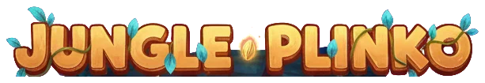
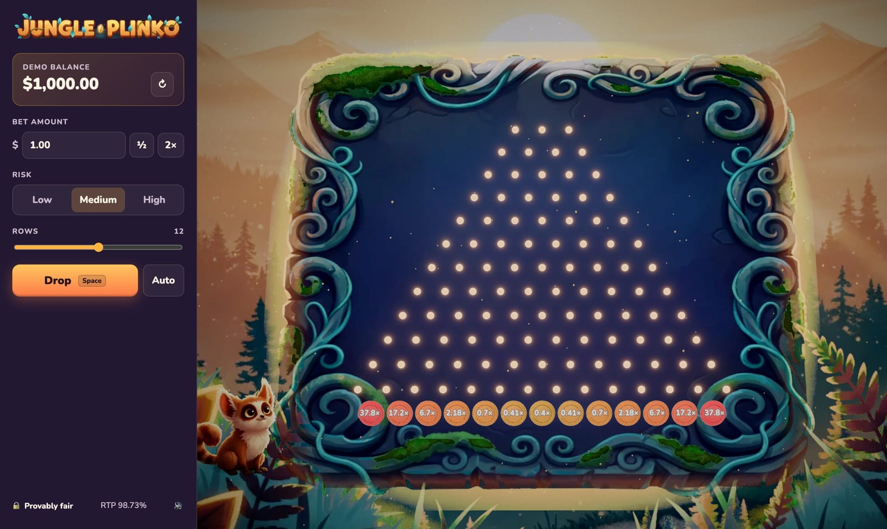

<div align="center">



**A provably fair 3D Plinko game for the browser, built with Three.js and painted in the style of Blender Studio's _Spring_.**




</div>

> [!NOTE]
> This is a prototype that uses **demo credits only**. No real money is involved.

## Features

- **Provably fair.** Every result comes from `HMAC-SHA256(serverSeed, clientSeed:nonce:round)`. Players can rotate seeds and re-verify any bet in the browser, using the same code the server runs.
- **Server-authoritative.** The server decides each outcome. The client only animates the path it receives.
- **Pay tables generated from a target RTP.** Multipliers are solved numerically for a 99% target RTP, then rounded down. The real RTP lands between 98.1% and 98.9%, depending on rows and risk. A Monte Carlo script checks it.
- **3 risk levels × 8–16 rows**, with payouts from 0.2× up to 1000×.
- **Painterly "Spring" look.** AI-painted backdrop and textures, warm rim light on every 3D prop, bloom, AgX tone mapping, a colour grade, vignette and film grain. Misty parallax layers, light shafts, drifting pollen, falling leaves and foreground ferns swaying in the wind.
- **Real 3D props on a painted board.** The seed ball, spore pegs and bucket plaques are AI-generated 3D models (Hyper3D Rodin), cleaned up in Blender. The board is the AI painting itself, with its full organic silhouette, volumetric "fur-shell" moss grown over the painted moss, a travelling light wave along its vines and a flash in the bucket's colour on wins.
- **A mascot animated with AI video.** A jungle creature beside the board loops an idle and plays a clip for each moment: it perks up when a ball drops, holds its breath when one heads for a big bucket, jumps and claps for wins, leaps for big wins and droops on losses. The clips are generated by AI with a transparent background (see [Mascot animation](#mascot-animation)); the earlier rigged 3D mascot remains as a fallback.
- **Game feel.**
  - Pegs pop in row by row.
  - The ball stretches along its velocity and squashes on every peg, throwing sparks while the peg pulses and sways like a spring.
  - Bucket plaques swing like a struck gong and send a ripple through their neighbours; the board frame flashes in the bucket's colour.
  - A multiplier floats up from the bucket on every hit of 2× or more, and big hits (10× and up) open a Big / Mega / Epic win banner.
  - Stereo-panned synth sound effects.
- **AI art pipeline.** One command generates every image with Nano Banana via OpenRouter, keeps a consistent style and keys out the backgrounds. Most missing images fall back to a procedural placeholder.
- **Responsive and accessible.** Works on phones, has keyboard shortcuts and ARIA labels, and respects `prefers-reduced-motion`.

## Quick start

```bash
git clone git@github.com:ItsJuniorDias/jungle-plinko.git
cd jungle-plinko
npm install
npm run dev
```

Open **http://localhost:5173**. `npm run dev` starts both the game server (`:8787`, or `API_PORT`) and the Vite dev server (`:5173`). Vite proxies `/api` to the game server.

### Deploy to Vercel

Import the repo in Vercel (the Vite preset is detected). The game API runs as Vercel Functions from `api/`, with the same code as the local server.

Before the first deploy, add a **`SESSION_SECRET`** environment variable (Project → Settings → Environment Variables) set to a long random string, for example the output of:

```bash
openssl rand -base64 32
```

Without it, the API answers `server_misconfigured`. Changing it later signs every player out (they get a fresh demo wallet).

| Shortcut | Action |
| --- | --- |
| <kbd>Space</kbd> | Drop a ball |
| <kbd>M</kbd> | Mute / unmute |
| <kbd>Esc</kbd> | Close the big-win banner |

## Scripts

| Command | What it does |
| --- | --- |
| `npm run dev` | Game server and Vite with hot reload |
| `npm run build` | Type-check and production build to `dist/` |
| `npm run typecheck` | TypeScript only |
| `npm run simulate -- 200000` | Monte Carlo RTP check: simulated vs theoretical for 8, 12 and 16 rows at every risk level (default 50,000 bets each) |
| `npm run art` | Generate any missing AI art (see [Art pipeline](#art-pipeline)) |
| `npm run mascot` | Generate the mascot's AI video clips (see [Mascot animation](#mascot-animation)) |

## How it works

### Provably fair

1. The server creates a random `serverSeed` and shows the player only `sha256(serverSeed)`.
2. Each bet derives floats from `HMAC_SHA256(key = serverSeed, msg = "clientSeed:nonce:round")`. Every 4 bytes become one float in `[0, 1)`.
3. Plinko reads one float per row: below `0.5` the ball goes left, otherwise right. The landing bucket is the number of rights.
4. **Rotate seeds** reveals the old `serverSeed`. Players can check that its hash matches the one shown earlier, then recompute any bet. Clicking a result in the history opens the verifier pre-filled with that bet.

The same `shared/` code runs on the server and in the browser through Web Crypto, so verification uses exactly the algorithm that produced the result.

### Pay tables

Bucket `k` on an `n`-row board has binomial probability `C(n,k) / 2ⁿ`. Instead of hand-written tables, each risk level fixes a **centre** payout and an **edge** payout for 8 and 16 rows, interpolated geometrically for the row counts in between. The exponent of the curve between them is then bisected until `Σ p(k)·m(k) = 0.99`, and every multiplier is rounded **down**. This guarantees the RTP never goes above the target.

| Rows | Risk | Min | Max | RTP |
| --- | --- | --- | --- | --- |
| 8 | low / medium / high | 0.5× / 0.4× / 0.2× | 5.6× / 13× / 29× | 98.80% / 98.53% / 98.50% |
| 12 | low / medium / high | 0.5× / 0.4× / 0.2× | 9.46× / 37.8× / 170× | 98.82% / 98.73% / 98.75% |
| 16 | low / medium / high | 0.5× / 0.4× / 0.2× | 16× / 110× / 1000× | 98.62% / 98.72% / 98.61% |

### Rendering

`src/engine/` is a small reusable layer that future games can share:

- **Stage** — renderer, camera framing, and the post-processing chain from [`postprocessing`](https://github.com/pmndrs/postprocessing): Bloom → AgX → hue/saturation → contrast → vignette → grain.
- **Environment** — painted backdrop, parallax layers, light shafts, pollen and leaves.
- **Materials** — `springMaterial()`, a toon ramp plus fresnel rim. `springify()` restyles any imported GLB.

The Plinko board draws all pegs in a single `InstancedMesh`. Ball motion is a choreographed path of parabolic arcs, so it plays the same at any frame rate.

## Project structure

```
shared/                 runs on the server and in the browser
  fair.ts               provably fair core (Web Crypto HMAC-SHA256 → floats)
  plinko.ts             board math, RTP-solved pay tables, outcome from seeds
server/game.ts          authoritative game logic: sealed sessions, demo wallet, bets, seed rotation
server/index.ts         local dev server for the API (node:http)
api/                    the same API as Vercel Functions (one file per endpoint)
src/
  main.ts               app wiring: controls, balance, history, big-win banner
  api.ts                typed client for the game server
  engine/               reusable 3D layer
    stage.ts            renderer, camera framing, post-processing
    environment.ts      Spring-style backdrop, parallax, light shafts, particles
    materials.ts        toon + rim-light materials, springify() for GLBs
    particles.ts        pooled additive particle bursts (one draw call)
    painted.ts          procedural placeholder textures and canvas labels
    art.ts              loads public/art/manifest.json (all entries optional)
    sfx.ts              Web Audio synth sound kit
  games/plinko/
    PlinkoBoard.ts      board, pegs, buckets, ball choreography, win popups, frame glow
    VideoMascot.ts      the mascot as AI video clips with alpha: idle loop + crossfaded reactions
    Mascot.ts           fallback 3D mascot: spring-driven reactions, idle fidgets, blinking eyelids
  ui/fairness.ts        provably fair dialog (seeds + verifier)
scripts/
  simulate.ts           Monte Carlo RTP check
  generate-art.ts       AI art generation + chroma keying
public/art/             game-ready 2D art (WebP) + manifest.json
public/models/          game-ready 3D props (GLB) + manifest.json
art/models/             Blender source (.blend) of the 3D props
```

### Game server API

All endpoints are `POST` with a JSON body. There is no database: the session (balance, seeds, nonce) travels in an encrypted `HttpOnly` cookie (AES-256-GCM, keyed by `SESSION_SECRET`) that every response renews. Players cannot read the active server seed or edit their balance. They could replay an old cookie to roll a session back, which is fine for demo credits; a real-money version needs a server-side store. Because each response renews the cookie, the client sends API calls one at a time.

| Endpoint | Body | Returns |
| --- | --- | --- |
| `/api/session` | `{}` | `sessionId`, `balance`, `serverSeedHash`, `clientSeed`, `nonce` (starts a session if there is none) |
| `/api/plinko/bet` | `{ amount (cents), rows, risk }` | `path`, `bucket`, `multiplier`, `payout`, `balance`, `nonce` |
| `/api/seeds/rotate` | `{ clientSeed? }` | the revealed previous seed + new public state |
| `/api/wallet/refill` | `{}` | public state with the demo balance reset |

## Art pipeline

Every image is generated with **Nano Banana** (`google/gemini-2.5-flash-image`) through [OpenRouter](https://openrouter.ai).

```bash
cp .env.example .env                    # then set OPENROUTER_API_KEY
npm run art                             # generate images that don't exist yet
npm run art -- board leaf --force       # regenerate specific assets
```

- **Style consistency.** The `background` image is generated first and acts as the **style anchor**: it is sent as a reference for the scene assets (forest layer, cover). Isolated objects use the shared style prompt only, because a reference image makes the model paste the whole landscape behind them.
- **Transparency.** Sprites are painted on flat magenta and chroma-keyed with `sharp`. The script detects the shade the model actually used from the border pixels, and also keys gradients by hue. It then un-mixes edge pixels so no magenta fringe remains.
- **No accidental spend.** An image counts as missing only when neither its raw output (`art/raw/`, git-ignored) nor its game-ready file (`public/art/`) exists. A fresh clone therefore makes no API calls until you pass `--force`.
- **Free re-processing.** Raw outputs are saved to `art/raw/`. With raw files present, re-running without `--force` only re-keys and re-crops, with no API calls.
- **Graceful fallback.** The game uses every entry in `public/art/manifest.json`. A missing background, forest layer, board, ball, peg or bucket gets a procedural placeholder. A missing foliage layer or leaf sprite is skipped, and a missing logo falls back to the text title.

Set `IMAGE_MODEL` in `.env` to try another model, for example `google/gemini-3.1-flash-image` (Nano Banana 2).

### 3D props

The 3D models were generated with **Hyper3D Rodin** (image-to-3D) through the Blender MCP, using the 2D art as references (the mascot comes from the cover art), then processed in Blender: decimated for mobile (400–9,000 triangles), centred and normalised to 1 unit, metallic/roughness maps dropped (toon shading only needs colour and normals), exported as GLB with WebP textures. The source file is `art/models/jungle-plinko-props.blend`.

### Mascot animation

`npm run mascot` (`scripts/mascot-video.ts`) makes the mascot's clips through OpenRouter:

1. **Reference pose.** Nano Banana redraws the mascot from the cover art in a neutral, full-body pose on a green screen.
2. **Clips.** An image-to-video model animates one clip per reaction from that pose (default `heygen/heygen-video-1`; set `MASCOT_VIDEO_MODEL`). With a model that also takes a last frame, such as `kwaivgi/kling-v3.0-std`, every clip ends on the pose too. Otherwise the idle loops forwards and backwards, and the game crossfades reactions back into it.
3. **Transparency.** A local green-screen key removes the background by how much green dominates red and blue, so even a dull screen comes off cleanly. It also un-mixes and despills the fur edges.
4. **Web encodes** in `public/mascot/`: WebM VP9 with alpha for Chrome, Firefox and Android, and HEVC with alpha (`.mov`) for Safari and iOS.

```bash
npm run mascot -- ref                          # the reference pose
npm run mascot -- idle drop tension happy bigWin sad
npm run mascot -- happy --force                # regenerate one clip (spends credits)
```

It needs `OPENROUTER_API_KEY` in `.env`. Raw clips are kept in `art/mascot-video/` (git-ignored), so re-running without `--force` only re-keys and re-encodes.

`src/engine/art.ts` loads `public/models/manifest.json`; every model is optional and falls back to the 2D sprite or procedural version.

## Roadmap

- [x] Plinko: provably fair, RTP-solved tables, Spring-style art and polish
- [x] AI-generated 3D props and a reacting mascot
- [x] Mascot animated with AI video clips (transparent background)
- [ ] Chicken Road with an animated 3D character (GLB + `springify()`)
- [ ] Crash: real-time multiplayer over WebSocket
- [ ] Port the server to NestJS + PostgreSQL with an operator wallet API (debit / credit / rollback, idempotent)
- [ ] Recorded, licensed sound design

## License

[MIT](LICENSE) © 2026 Alexandre Junior
